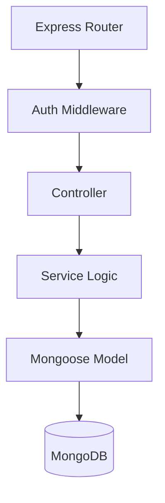
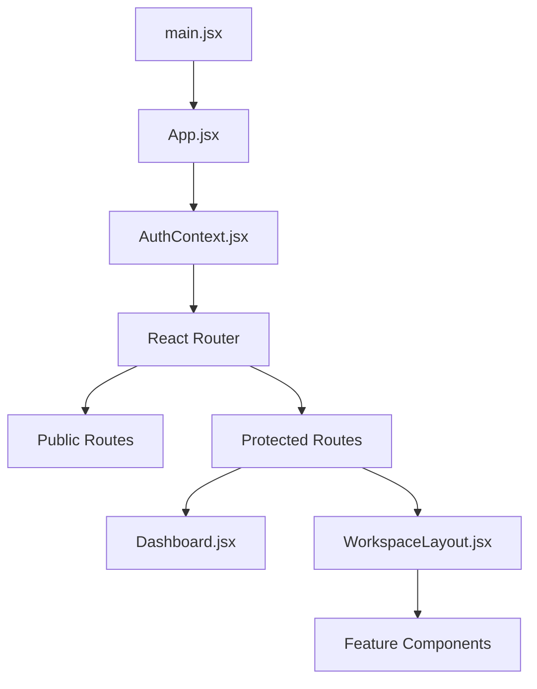

# Project Inventory

This document maps out the entire Teamora Collaboration Workspace repository, providing clear dependency graphs and feature mappings.

## Core Dependency Graphs

### Backend Request Flow

### Frontend Rendering Flow

## Folder Inventory

### Frontend Folders
| Folder | Purpose | Responsibility | Dependencies |
|--------|---------|----------------|--------------|
| `frontend/src/components` | Core UI Views | Layouts and pages for major features. | `lucide-react`, `React`, `services/api.js` |
| `frontend/src/features/auth` | Authentication | Handling login, signup, and profiles. | `AuthContext.jsx`, `services/auth.js` |
| `frontend/src/features/workspace` | Workspace Shell | Rendering the layout (navbar, sidebar). | `AuthContext.jsx`, `react-router-dom` |
| `frontend/src/services` | External I/O | API fetching, WebSocket hub logic. | `axios`, `wsHub.js`, `yjs` |
| `frontend/src/contexts` | Global State | Storing user session and active meetings. | React Context API |

### Backend Folders
| Folder | Purpose | Responsibility | Dependencies |
|--------|---------|----------------|--------------|
| `backend/src/controllers` | HTTP Handlers | Formatting HTTP req/res. | `services/*` |
| `backend/src/services` | Business Logic | Executing operations, talking to DB. | `models/*`, `bcrypt` |
| `backend/src/models` | Data Schemas | Defining MongoDB collections. | `mongoose` |
| `backend/src/routes` | API Definitions | Routing URL paths to controllers. | `express`, `controllers/*` |
| `backend/src/collab` | Realtime Hub | WebSocket server for fanout messaging. | `ws`, `express-session` |

## File Inventory (Key Files)

### Backend

**`backend/src/server.js`**
- **Purpose:** Entry point for the backend.
- **Approx. Size:** ~50 lines.
- **Imports:** `http`, `app.js`, `config/database.js`, `collab/wsHub.js`.
- **Called by:** Node.js (via `npm start`).
- **Calls:** DB connect, HTTP server listen, WebSocket attach.
- **Responsibilities:** Bootstrapping the server and attaching the WebSocket hub to the HTTP server upgrade event.

**`backend/src/app.js`**
- **Purpose:** Express application configuration.
- **Approx. Size:** ~100 lines.
- **Imports:** Express middleware, routes, Passport config.
- **Called by:** `server.js`.
- **Responsibilities:** Setting up CORS, parsers, sessions, and registering API routers.

**`backend/src/collab/wsHub.js`**
- **Purpose:** Realtime WebSocket signaling.
- **Approx. Size:** ~300 lines.
- **Imports:** `ws`, `Workspace.js`.
- **Responsibilities:** Authenticates WS connections, manages `workspaceId::key` rooms, and fans out WebRTC and Yjs payloads to peers.

### Frontend

**`frontend/src/App.jsx`**
- **Purpose:** Root application component and router.
- **Approx. Size:** ~1000 lines.
- **Imports:** `react-router-dom`, context providers, all page components.
- **Responsibilities:** Routing logic, managing active workspace state, loading preferences.

**`frontend/src/services/restYjsProvider.js`**
- **Purpose:** Hybrid Yjs sync provider.
- **Approx. Size:** ~160 lines.
- **Imports:** `yjs`, `workspaceContent.js`, `collabSocket.js`.
- **Responsibilities:** Connecting local Y.Doc to REST backend for durable saving and to WebSockets for low-latency synchronization.

**`frontend/src/contexts/MeetingContext.jsx`**
- **Purpose:** Global meeting state.
- **Approx. Size:** ~350 lines.
- **Imports:** `meetingPeerManager.js`, `meetingSocket.js`.
- **Responsibilities:** Handles joining/leaving meetings, tracking tracks, generating WebRTC connections across the app.

## Feature-to-File Mappings

| Feature | Primary Frontend Files | Primary Backend Files |
|---------|------------------------|-----------------------|
| **Auth** | `AuthPage.jsx`, `AuthContext.jsx` | `auth.routes.js`, `auth.controller.js`, `User.js` |
| **Workspace Shell** | `WorkspaceHome.jsx`, `WorkspaceLayout.jsx` | `workspace.routes.js`, `Workspace.js` |
| **Documents** | `Documents.jsx`, `restYjsProvider.js` | `content.controller.js`, `WorkspaceContent.js` |
| **Whiteboard** | `Whiteboard.jsx`, `canvasOverlays.js` | `content.controller.js`, `wsHub.js` |
| **Meetings** | `GlobalMeetings.jsx`, `MeetingContext.jsx`, `meetingPeerManager.js` | `wsHub.js` |
| **Spreadsheet** | `Spreadsheet.jsx` | `content.controller.js` |

## API-to-Controller Mappings

| Endpoint Route | Handled By Controller | Method |
|----------------|-----------------------|--------|
| `/api/v1/auth/login` | `authController.login` | POST |
| `/api/v1/workspaces/` | `workspaceController.createWorkspace` | POST |
| `/api/v1/workspaces/:id` | `workspaceController.getWorkspaceById` | GET |
| `/api/v1/workspaces/:id/content/:key` | `contentController.getContent` | GET |

## Service-to-Model Mappings

- **`workspace.service.js`** relies on `Workspace.js` and `User.js`.
- **`auth.service.js`** relies on `User.js`.
- **`content.service.js`** relies on `WorkspaceContent.js` and `Workspace.js`.

## Context Dependency Graph
- **`AuthContext`** (Provides `user`, `authenticated`) -> Used by `App.jsx`, `WorkspaceHome.jsx`, `ProtectedRoute.jsx`.
- **`MeetingContext`** (Provides `activeMeeting`, `joinMeeting`) -> Depends on `AuthContext`. Used by `WorkspaceHome.jsx`, `GlobalMeetings.jsx`.
