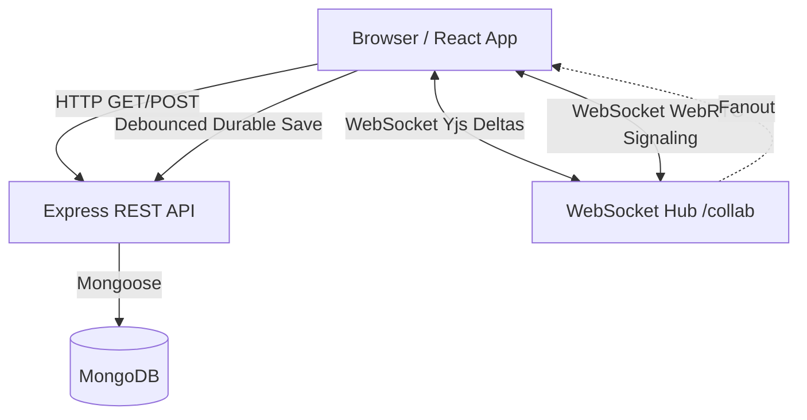

# Teamora Collaboration Workspace

## Project Overview

Teamora is a comprehensive real-time collaboration workspace designed for remote teams and individuals who need a unified platform to create, share, and communicate. The primary purpose is to eliminate the need for disjointed tools by centralizing documents, spreadsheets, presentations, whiteboards, tasks, and real-time audio/video meetings into a single, cohesive environment. 

**Target Users:** Remote teams, educators, startups, and anyone looking for an all-in-one productivity suite with real-time sync.

## Tech Stack

- **Frontend Framework:** React 19 + Vite (for high-performance rendering and fast HMR).
- **Styling:** Tailwind CSS v4 (for utility-first, rapid UI development).
- **State & Realtime Sync:** Yjs (CRDT for conflict-free distributed editing of documents and structured data).
- **Rich Text Editing:** Quill (`y-quill`) (for collaborative document editing).
- **Spreadsheets:** SheetJS (for parsing and exporting Excel/CSV files).
- **Presentations:** JSZip & PPTX parsers (for custom rendering of PowerPoint slides).
- **Meetings & Audio/Video:** WebRTC with a custom signaling Mesh architecture over WebSockets (no SFU/MCU).
- **Backend Server:** Node.js + Express (for durable REST API state).
- **Realtime WebSocket Hub:** `ws` (Lightweight fanout hub for Yjs deltas and WebRTC signaling).
- **Database:** MongoDB / Mongoose (for durable persistence of users, workspaces, and workspace content blobs).
- **Authentication:** Passport.js (Local Strategy and Google OAuth20) with `express-session`.

## High-Level Architecture



## Folder Structure

### `/frontend`
- **`src/components/`**: Core UI views and feature pages (e.g., `Documents.jsx`, `Whiteboard.jsx`, `Dashboard.jsx`).
- **`src/components/ui/`**: Reusable base UI elements (e.g., `Button.jsx`, `Modal.jsx`, `Input.jsx`).
- **`src/features/`**: Domain-specific modules grouped by feature.
  - **`auth/`**: Authentication pages and hooks.
  - **`workspace/`**: Workspace layout, sidebar, and navbar components.
- **`src/services/`**: API and WebSocket connection logic (`api.js`, `collabSocket.js`, `restYjsProvider.js`, `meetingPeerManager.js`).
- **`src/contexts/`**: Global state providers (`AuthContext.jsx`, `MeetingContext.jsx`).
- **`src/hooks/`**: Custom React hooks (`useMeetingSignaling.js`, `useLocalCollabChannel.js`).

### `/backend`
- **`src/controllers/`**: HTTP request handlers (Auth, Workspace, Content).
- **`src/models/`**: Mongoose schemas (`User.js`, `Workspace.js`, `WorkspaceContent.js`).
- **`src/routes/`**: Express route definitions mapping URLs to controllers.
- **`src/middleware/`**: Request interceptors (e.g., `auth.middleware.js`).
- **`src/services/`**: Business logic and email sending (`auth.service.js`, `email.service.js`).
- **`src/collab/`**: WebSocket hub implementation (`wsHub.js`).
- **`src/config/`**: Setup for Passport, Sessions, and DB connections.

## Feature Overview

### Authentication
- **Purpose:** Secure user access and session management.
- **Main Components:** `AuthPage.jsx`, `AuthContext.jsx`.
- **Backend Endpoints:** `/api/v1/auth/login`, `/register`, `/google`, `/me`.
- **Database:** `User` collection.

### Workspaces
- **Purpose:** Isolated environments where teams collaborate. Supports invite links, visibility controls, and member management.
- **Main Components:** `Dashboard.jsx`, `WorkspaceLayout.jsx`, `WorkspaceHome.jsx`.
- **Backend Endpoints:** `/api/v1/workspaces/` (CRUD, Join, Leave, Tasks).
- **Database:** `Workspace` collection.

### Documents
- **Purpose:** Collaborative rich-text editing using Yjs and Quill.
- **Main Components:** `DocumentsSection.jsx`, `Documents.jsx`.
- **Backend Endpoints:** `/api/v1/workspaces/:id/content`
- **Database:** `WorkspaceContent` collection.

### Whiteboard
- **Purpose:** Freeform drawing and shapes on an HTML5 canvas.
- **Main Components:** `WhiteboardSection.jsx`, `Whiteboard.jsx`, `canvasOverlays.js`.

### Spreadsheet
- **Purpose:** Grid-based data entry with Excel import/export (experimental).
- **Main Components:** `SpreadsheetSection.jsx`, `Spreadsheet.jsx`.

### Presentations
- **Purpose:** Upload and view PPTX files synchronously.
- **Main Components:** `PresentationSection.jsx`, `Slides.jsx`.

### Meetings
- **Purpose:** Real-time audio/video calls using WebRTC.
- **Main Components:** `GlobalMeetings.jsx`, `MeetingContext.jsx`, `meetingPeerManager.js`.
- **Events:** `meeting-event`, `meeting-started`, `meeting-join`.

### Tasks
- **Purpose:** To-do lists and calendar management inside workspaces.
- **Main Components:** `Calendar.jsx`, `WorkspaceHome.jsx` (Tasks pane).
- **Database:** Stored directly inside the `Workspace` model document.

### Shared Files
- **Purpose:** Upload, share, and download files.
- **Main Components:** `SharedFilesSection.jsx`, `Files.jsx`.
- **Limitations:** Currently stores file base64 data in MongoDB blobs (not optimized for large binaries).

### Realtime Collaboration
- **Purpose:** Ensure all users see the same state instantly.
- **Main Components:** `wsHub.js`, `restYjsProvider.js`, `collabSocket.js`.

## Data Flow & Lifecycles

### General Request Lifecycle (Browser to Database)
1. **User Click:** User clicks "Save Workspace".
2. **React Component:** `WorkspaceHome.jsx` calls `updateWorkspace`.
3. **API Service:** `api.js` (Axios) sends PUT request to `/api/v1/workspaces/:id`.
4. **Express Route:** `workspace.routes.js` routes to `workspaceController.updateWorkspace`.
5. **Middleware:** `auth.middleware.js` verifies `req.session.userId`.
6. **Controller & Service:** `workspace.service.js` updates Mongoose.
7. **Database:** MongoDB writes changes.
8. **Response:** JSON `{ workspace: {...} }` returned.
9. **UI Update:** React state updates and forces re-render.

### Realtime Synchronization Lifecycle (Yjs/WebSocket)
1. User types in Quill editor.
2. `y-quill` applies the change to the local `Y.Doc`.
3. `restYjsProvider.js` serializes the update to base64.
4. The update is broadcasted immediately via `collabSocket.js` to `wsHub.js` over WebSocket.
5. `wsHub.js` fans out the raw binary payload to all connected peers in the room.
6. Peers apply the remote update to their local `Y.Doc`, updating their UI.
7. **Durability:** Concurrently, `restYjsProvider.js` debounces the local updates and pushes a durable snapshot to the REST API (`PUT /content/:key`).

### Authentication Lifecycle
1. User submits login form.
2. `auth.controller.js` validates credentials using `bcrypt`.
3. `req.session.userId` is set via `express-session`.
4. HTTP-only session cookie is returned to the browser.
5. Frontend calls `/me` to verify session and load `AuthContext`.
6. WebSockets authenticate by inheriting the HTTP-only session cookie during the upgrade request in `wsHub.js`.

### Meeting/WebRTC Signaling Lifecycle
1. User clicks "Join Meeting".
2. Frontend emits a `meeting-event` (type: `meeting-join`) payload to the WebSocket hub.
3. `wsHub.js` stores active meeting state and broadcasts it.
4. `meetingPeerManager.js` handles peer connections, creating WebRTC RTCPeerConnections.
5. SDP Offers/Answers and ICE Candidates are exchanged via WebSocket `meeting-event` messages.
6. Direct peer-to-peer WebRTC channels are established for audio/video tracks.

### Document Save Lifecycle
1. User edits document. Local Yjs state changes.
2. WebSocket pushes ephemeral delta.
3. Debounce timer triggers in `restYjsProvider.js`.
4. Snapshot is converted to Base64.
5. REST PUT request saves the blob to the `WorkspaceContent` MongoDB collection.

### Spreadsheet, Whiteboard, and Presentation Lifecycles
Currently, these modules use standard state structures or `Y.Map`/`Y.Array` architectures synchronized via the exact same `restYjsProvider.js` pipeline as the Documents feature. Custom logic intercepts changes (e.g., drawing on a canvas) and translates them into Yjs map updates.

### File Upload Lifecycle
1. User drops a file in `SharedFilesSection`.
2. File is read as Base64 using `FileReader`.
3. Payload is pushed via REST to the `WorkspaceContent` collection as a blob entry.
4. A WebSocket event triggers other clients to fetch the new content list.

## Installation & Running Locally

1. **Clone the repository.**
2. **Install Backend Dependencies:**
   ```bash
   cd backend
   npm install
   ```
3. **Install Frontend Dependencies:**
   ```bash
   cd frontend
   npm install
   ```
4. **Environment Variables:**
   - Create `backend/.env`:
     ```env
     PORT=3000
     MONGO_URI=mongodb://localhost:27017/collab-workspace
     CLIENT_URL=http://localhost:5173
     SESSION_SECRET=your_super_secret_key
     ```
   - Create `frontend/.env`:
     ```env
     VITE_API_URL=http://localhost:3000
     ```
5. **Start Services:**
   - Backend: `npm run dev` (starts on port 3000)
   - Frontend: `npm run dev` (starts on port 5173)

## API Overview

**Auth Routes (`/api/v1/auth`)**
- `POST /register`, `POST /login`, `POST /logout`
- `GET /me`, `PATCH /profile`
- `POST /forgot-password`, `POST /reset-password`
- `GET /google`, `GET /google/callback`

**Workspace Routes (`/api/v1/workspaces`)**
- `GET /`, `POST /` (List / Create)
- `GET /:id`, `PUT /:id`, `DELETE /:id`
- `POST /join`, `POST /:id/leave`, `POST /invite/:code/request`
- `GET /:id/tasks`, `POST /:id/tasks`, `PATCH /:id/tasks/:taskId`, `DELETE /:id/tasks/:taskId`
- `DELETE /:id/members/:memberId`

**Content Routes (`/api/v1/workspaces/:id/content`)**
- `GET /:key`, `PUT /:key` (Retrieve/Save Yjs Blobs)

## Database Overview

- **User**: Stores authentication credentials, profile information, and password reset tokens.
- **Workspace**: Stores workspace metadata, settings (join approvals, visibility), tasks array, member arrays (with roles), and pending join requests.
- **WorkspaceContent**: Key-value blob store for document states, files, and whiteboard JSON dumps. Indexed uniquely by `{ workspace, key }`.

## Future Improvements
- **Grid WebRTC Scalability:** Move from Full Mesh WebRTC to an SFU (Selective Forwarding Unit) to reduce bandwidth on calls with >5 participants.
- **File Storage:** Migrate file blobs from MongoDB to an S3-compatible object storage provider.
- **Pagination:** Implement pagination on the Dashboard for users with many workspaces.
- **Yjs Server Authority:** Transition the WebSocket hub to run a headless Yjs server-side instance to guarantee eventual consistency and merge resolution on the server.
